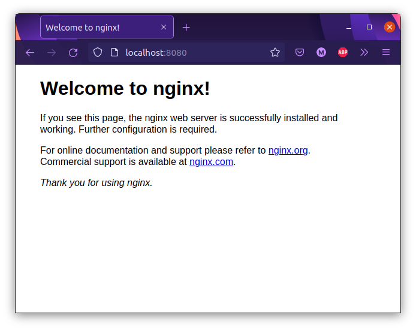
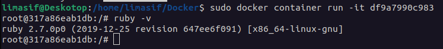
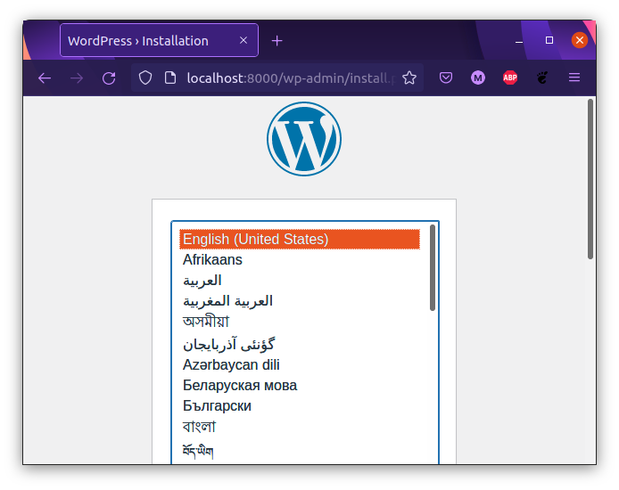

# Docker
1. Download nginx container
```
sudo docker pull nginx
```
2. Run nginx container with access via browser
```
sode docker container run -p 8080:80 nginx
```
Result:


3. Download MySQL container
```
sudo docker pull mysql
```
4. Run MySQL container
```
sudo docker run -v /home/user/Docker/data:/var/lib/mysql -e MYSQL_ROOT_PASSWORD=password mysql
```
5. Connect to MySQL container
```
sudo docker exec -it [container_id] mysql -u root -p
```
6. Add new user and new database
```
CREATE USER 'limasif'@'localhost' IDENTIFIED BY 'mysecretpassword';
CREATE DATABASE my_db;
exit
```
7. Create Docker file ([example](./Dockerfile))
8. Build cointainer
```
sudo docker build .
```
9. Run new container and check ruby version
```
sudo docker container run -it [image]
ruby -v
```
Result:


10. Install docker-compose on host
```
apt-get update && apt-get install docker-compose
```
11. Config docker-compose.yml ([example](./docker-compose.yml)) and run wordpress cite
```
docker-compose up -d
```
Result:
