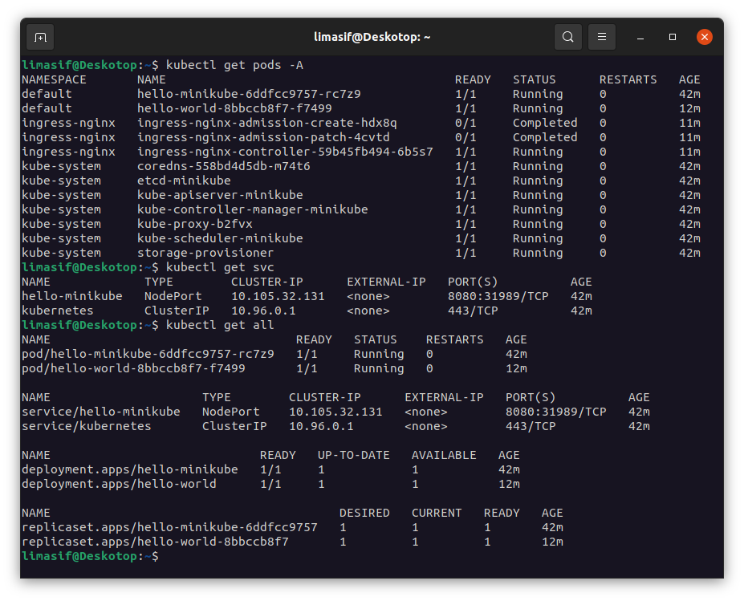

# Kubernetes
1. Create namespace
```
minikube start
kubectl create deployment hello-minikube --image=k8s.gcr.io/echoserver:1.4
kubectl expose deployment hello-minikube --type=NodePort --port=8080
```
2. Create deployments file ([example](./deployments.yaml)) and apply it
```
kubectl apply -f ./deployments.yaml
```
3. Install ingress
```
minikube addons enable ingress
```
4. Create ingress rule file ([example](./ingress.yaml)) and apply it
```
kubectl apply -f ./ingress.yaml
```

Result:
